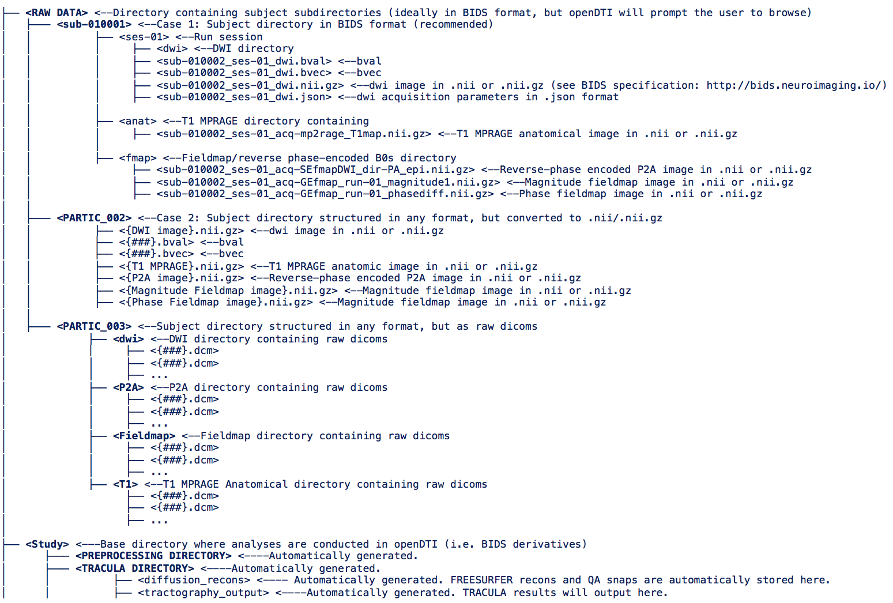

```
OpenDTI: A dMRI pipeline for efficient and comprehensive DTI analysis
Copyright (C) 2016  AUTHOR: Derek Pisner
Contributors: Adam Bernstein, Aleksandra Klimova, Matthew Allbright

OpenDTI is free software: you can redistribute it and/or modify
it under the terms of the GNU Affero General Public License as published
by the Free Software Foundation, either version 3 of the License, or
(at your option) any later version.

OpenDTI is distributed in the hope that it will be useful,
but WITHOUT ANY WARRANTY; without even the implied warranty of
MERCHANTABILITY or FITNESS FOR A PARTICULAR PURPOSE.  See the
GNU Affero General Public License for more details.

You should have received a copy of the complete GNU Affero General Public 
License with OpenDTI in a file called LICENSE.txt. If not, and/or you simply have 
questions about licensing and copyright/patent restrictions with openDTI, please 
contact the primary author, Derek Pisner, at dpisner@utexas.edu
```
Aims and the lanaguage(s) of dMRI
I. OpenDTI was built using SGE, PBS, and SLURM schedulers, but can be implemented on any supercomputer configuration or local machine. It is BIDS-compliant, but through decision-tree logic, it also learns from your files so as to process dMRI data in any format with any acquisition parameters, even if those parameters vary across a dataset. OpenDTI obviates the need for ongoing user interaction at each analysis stage. openDTI covers core stages of analysis including: preprocessing, quality-control, global deterministic and probabilistic tractography, tragtographic metric extraction, database population, and structural connectome-mapping.

II. The aim of OpenDTI is to enable near-total automation and flexible customization of each stage in dMRI analysis through a highly-verbose pipeline that auto-decides based on the unique characteristics of your data and the computational resources available how to optimally run each analysis stage. OpenDTI is continually developed using an amalgamation of existing popular software (e.g. FSL, FREESURFER, Diffusion Toolkit). openDTI harnesseses the simplicity of UNIX shell scripting as foundational OS syntax, the power and speed of of C/C++ for most resource-intensive functions, and the flexibility of python to cover most other operations that would be less convenient, impossible, or inefficient to execute with shell scripting and to provide 'wrappers' that ensure interoperability of functions originally built in other programming languages like MATLAB or javascript. OpenDTI autoamtically adapts to different dMRI data types (i.e. multiple directions/ high b-values/ HARDI/ DSI/ Q-ball) as well as detects and optimally utilizes available hardware capabilities for maximal operating efficiency (e.g. auto-detects local cores for use with openMP and MPI, utilizes GPU's for CUDA-enabled acceleration, as well as job schedulers like SGE, UNIVA, Torque/PBS, Slurm, or Condor for queuing parallel jobs), but also allows the user to easily and manually adjust these for exceptions that may occur. Other aims of OpenDTI are straightforwardness, portability, and simplicity-- both for the developer and especially for the user. Although openDTI is built to provide a highly automated framework that can facilitate more efficient dMRI software development, its ultimate objective is to provide an unprecented level of flexibility in dMRI analysis to the end-user. Thus, minimalism, verbosity, and automation are central to the philosophy of OpenDTI's development. Along these lines, we anticipate that OpenDTI will facilitate rapid and automated analyses for very large dMRI datasets-- a goal that has, until now, been computationally infeasible. This latter expectation inevitably places an emphasis on highly parallelized code and a preference towards running OpenDTI on supercomputing clusters and developing functions with CUDA syntax alternatives that can capitalize on the immense computing power of GPU's. Given the emphasis on automation, one area that becomes critical for OpenDTI is automated error-checking, which must be as thorough as possible given the low degree of user interaction and manual visual inspection.

III. Additionally, and perhaps most importantly, we wish to incorporate a maximally comprehensive library of the most up-to-date computational tools in a well-organized and transparent framework to ensure the highest data quality and facilitate more rapid development in the field of dMRI image processing. To that end, it is also our hope that OpenDTI can become truly that -- open. If researchers in the DTI community can continue to develop and improve OpenDTI by incorporating new algorithms, routines, revisions, variations, and innovative stage varieties that can eventually elevate dMRI analysis to new heights of sensitivity and specificity in strucutral neuroimaging research, we can collectively improve the quality of research in the dMRI arena along with our ability to capture the subtle and rich detail of the immensely complicated wiring diagram that is the white matter of the human brain. 

IV. The philosophy of OpenDTI is thus to take as the foundation of dMRI analysis the available functions in FSL, FREESURFER, and Dipy. Further, we choose BASH at the systems-level of openDTI's operations because it is incredibly powerful and portable, and because we wish to keep syntax open-source and as close to the native tongue (i.e. bash and tcsh) of FSL and FREESURFER as possible to ensure that new developments from FSL and FREESURFER can be easily and readily integrated into our pipelines. Whereas comparable single-subject analysis pipelines for fMRI may be better addressed using Python-based tools such as the Nipype framework due to the tremendous heterogeneity of fMRI software available, the core obstacle for dMRI analysis pipelines is not software interoperability, but efficiency given the higher computational demands required to analyze dMRI data. Thus, the creators of openDTI contend that scalable dMRI analysis is more appropriately handled in a UNIX-dominant framework, where Python syntax instead serves the critical role of 'filling in the gaps' with functions that are not straightforward or readily available within FSL and FREESURFER, so as to still ensure that innovations outside of FSL and FREESURFER are still easily and readily available for inclusion in OpenDTI's developement. In essence, we wish to restrict python usage to especially cumbersome tasks that would be more difficult to accomplish in shell (e.g. any complex calculations, graph theoretical analysis, arrays, variable-rich functions, machine-learning extensions, etc.), as well as to wrap functions that would otherwise be too cumbersome to call from the command prompt (esp. MATLAB and other proprietary software tools). In this way, our goal is to create a unified workflow that can be run entirely from the command prompt with user syntax restricted to bash and python centrally, and underlying functions written in high-speed syntax like C/C++. Other languages (MATLAB, R, Perl) should only be used sparingly and for otherwise non-available features in the OpenDTI environment.

OpenDTI's Engine explained:
V. The openDTI workflow firstly consists of two workflow engine scripts: FEED_openDTI.sh and openDTI.sh. FEED_openDTI.sh is a script for user input-- it has getopts command line options as well as default configuration options located in openDTI/Main_scripts/config.ini where you can optionally modify defaults for how you want your dMRI analysis pipeline to run (e.g. with TOPUP/EDDY, but without denoising; or without probabilistic tractography, but with deterministic tractography). One major goal of openDTI is to provide as many of these kinds of pipeline customization options to the user as possible. FEED_openDTI.sh gathers all necessary inputs, checks for missing inputs, and creates a variable environment (i.e. in python terms, this would be akin to a "namespace") with all of these options and file paths to be "passed" to openDTI.sh-- the workflow engine that ties all of the stages of the analysis pipeline together. In essence, what drives the workflow is therefore simple variable setting/passing based on triggers set by unique aspects emerging from previous stages that have completed. Some of these variables are switches to turn on/off various stages, whereas other variables actually contain values that are used to customize the way the stages run. OpenDTI.sh's primary job is to receive the core set of variables (e.g. containing filepaths to raw data directories and stage customization characteristics, etc.) from FEED_openDTI.sh and use them to trigger various different stage scripts run, also passing along active variables to those subsequent scripts. OpenDTI is variable passing. Each stage (preprocessing, diffusion model fitting, quality control, FREESURFER reconstruction, TRACULA, etc.) gets its own stage script located in the Stage_scripts directory. In sum, OpenDTI.sh works by sending all pertinent variables and file paths to each stage script relevant to the workflow setting selected. Those stage scripts in turn receive the active variables and relevant file paths in order to run all selected sub-stages in sequence.

```
##Installation, System Requirements and Dependencies
REQUIRED: A linux-based OS. openDTI is written primarily in bash, and as such, must be installed on a linux operating system. *Note: The included install script is only configured for installation on UBUNTU/Debian and CentOS/Fedora/RedHat versions 7. The install script could easily be customized, however, to install on other linux-based OS's.
REQUIRED: FSL should be installed and sourced from the .bashrc with FSLDIR as the path variable.
REQUIRED: FREESURFER should be installed and sourced from the .bashrc, with FREESURFER_HOME as the path variable.
REQUIRED: openDTI itself should be installed and sourced from the .bashrc, with openDTI_HOME as the path variable.
REQUIRED: A study directory with a lot of space, where everything will be preprocessed and analyzed. The path to the study directory is what is specified in the first entry in the command line.
REQUIRED: read, write, and execute permissions on files and folders used by openDTI within your specified study directory. *NOTE: you may need to ensure that access control lists are set to permit inherited rwx permissions for any folder or file created within the study directory.
HIGHLY RECOMMENDED: Parallel computing capabilities. openDTI was designed to be as parallelized and efficient as currently available technology permits. Thus, openDTI works most optimally on a cluster equipped with a job scheduler in either the GridEngine/Univa/SGE or PBS/Torque families. The FSL function fsl_sub should be customized accordingly to accommodate for the job scheduler type being used. Without a cluster/job scheduler to enabled parallelization, processing time for most stages of openDTI will increase substantially.
OPTIONAL: Altering default configuration options  (i.e. default variable values and stage settings) beyond what you list as flags with the FEED_openDTI.sh command can be accomplished by editing the openDTI/Main_scripts/config.ini file. These variables will be sourced as default values into FEED_openDTI.sh and use of command line flags will override these default values.
```



*Note: if BIDS format is used for raw data and an appropriate .json scan parameters file is generated, openDTI will detect and utilized this so that TE, TR, dwell, and readout values do not need to be specified manually on the command line in order to run those stages that require these values e.g. TOPUP/EDDY, fugue, etc.

 
Installation: 
You must run install.sh before using openDTI. To do this, first decompress the tarball into an installation directory of your choice. Example: 
```{bash}
tar -xzvf openDTI.tar.gz 
```
Finally, before running openDTI, add the following lines to your ~/.bashrc file and source ~/.bashrc files to enable to openDTI commandline environment:
```{bash}
export openDTI_HOME={install directory path}
source $openDTI_HOME/Set_openDTI_Env.sh
```

THIRD-PARTY SOFTWARE INCLUDED WITH INSTALL
```
1. dcm2nii must be able to run from the command line and it has been included in openDTI's core files to accomodate for this. The included installer script will automatically install dcm2nii to /usr/local/bin (If you experience any difficulties with the included dcm2nii executable, I recommend downloading dcm2nii as part of the MRIcron package from http://www.nitrc.org/frs/?group_id=152) and modifying preprocess.sh accordingly.
	Author: Christopher Rorden
```

```
2. For semi-automated quality control of FREESURFER recons, you will need a copy of GAWK (can be found at http://www.gnu.org/software/gawk/) and Image Magick Studio (can be found at http://www.imagemagick.org/script/index.php). The included installer script installs these using yum (redhat 7/fedora/ CentOS 7) or apt-get (ubuntu 14.04/ Debian).
	Author: David Koh, Stephanie Lee, Jenni Pacheco, Vasanth Pappu, and Louis Vinke at MGH
```

```
3. NLSAM (Non-Local Spatial and Angular Matching) Denoising software has been included with openDTI's core files in the directory "NLSAM". *NOTE: This is a brand new, experimental algorithm written in python. It currently only runs on debian/ubuntu-based OS's and requires the python SPArse Modeling Software (SPAMS) toolbox.
	Citation: St-Jean, S., P. Coupé, and M. Descoteaux. "Non Local Spatial and Angular Matching : Enabling higher spatial resolution diffusion MRI datasets through adaptive denoising." Medical Image Analysis, 2016.
```
```
4. Motion Plotting Scripts
ec_plot.sh and ec_plot_NEW.sh (for use following eddy_correct and new EDDY correction with TOPUP, respectively) were created by Jesper Anderson at FSL with several additional components added to alert in cases of detetcted excess motion according to translation and rotation thresholds recently established (2 mm translation and 0.2 radians rotation) 
	Citation: Yendiki, A., Koldewyn, K., Kakunoori, S., Kanwisher, N., & Fischl, B. (2014). Spurious group differences due to head motion in a diffusion MRI study. NeuroImage, 88, 79–90. http://doi.org/10.1016/j.neuroimage.2013.11.027
	Citation: Jesper L.R. Andersson and Stamatios N. Sotiropoulos. An integrated approach to correction for off-resonance effects and subject movement in diffusion MR imaging. NeuroImage, 125:1063-1078, 2016.
```
```
5. For NRRD conversion, DWIconvert from the DTIPrep package is included with openDTI's core package.
Alternative format to NIFTI for combining dicom information into a single, organized file. .NRRD formatted DTI data is used primarily for visualization in 3d slicer. *NOTE: 3dslicer, like diffusion toolkit, requires a transposed bvec input (i.e. gradient table) to represent directional information. 
	Source: DWIconvert is part of the National Alliance for Medical Image Computing (NA-MIC), funded by the National Institutes of Health through the NIH Roadmap for Medical Research, Grant U54 EB005149. Information on NA-MIC can be obtained from the NA-MIC website. Author: Vince Magnotta (UIowa). Contributors: Hans Johnson (UIowa), Joy Matsui (UIowa), Kent Williams (UIowa), Mark Scully (Uiowa), Xiaodong Tao (GE)
```
```
6. TRACULA global probabilistic tractography
TRACULA (TRActs Constrained by UnderLying Anatomy) is a tool for automatic reconstruction of a set of major white-matter pathways from diffusion-weighted MR images. It uses global probabilistic tractography with anatomical priors. Prior distributions on the neighboring anatomical structures of each pathway are derived from an atlas and combined with the FreeSurfer cortical parcellation and subcortical segmentation of the subject that is being analyzed to constrain the tractography solutions. This obviates the need for user interaction, e.g., to draw ROIs manually or to set thresholds on path angle and length, and thus automates the application of tractography to large datasets.
	Citation: Automated probabilistic reconstruction of white-matter pathways in health and disease using an atlas of the underlying anatomy. Yendiki A, Panneck P, Srinivasan P, Stevens A, Zöllei L, Augustinack J, Wang R, Salat D, Ehrlich S, Behrens T, Jbabdi S, Gollub R and Fischl B (2011). Front. Neuroinform. 5:23. doi: 10.3389/fninf.2011.00023
```

```
7. Diffusion Toolkit deterministic tractography
Diffusion Toolkit is a software tool for the performance of data reconstruction and fiber tracking for diffusion MR imaging, utilizing but not limited to tensor data, diffusion spectrum imaging (DSI), high angular resolution diffusion imaging (HARDI) data and Q-ball imaging data.
	Citation: Wang, R., Benner, T., Sorensen, A. G., & Wedeen, V. J. (2007). Diffusion Toolkit : A Software Package for Diffusion Imaging Data Processing and Tractography. In Proc. Intl. Soc. Mag. Reson. Med. (Vol. 15, p. 3720). 
```

```
8. For connectome reconstruction, the python script connectome_plot.py is used. It requires a few python dependencies (NumPy, matplotlib, nibabel, codecs). The installer script installs these automatically using pip (so be sure you have installed python-pip).
```
MULTI-SUBJECT BATCHING 
For batching multiple participants simultaneously, you can substitute participant ID's as a variable in a for loop. Upon each loop iteration, a subject's analysis pipeline will open in a new terminal window (Using other terminal types, you may be able to have each loop run sent to multiple tabs within a single window) *NOTE: for this to work, you will probably want to: 1) hard code the locations of your T1MPRAGE anatomical images (T1directory), DWI images (dwi_dir), and P2A images (P2A), otherwise the script will trigger the GUI for you to select these files manually for each loop iteration; and 2) Impose strict cpu and virtual memory restrictions in your parallel scheduler to ensure safe hardware usage (i.e. batching subejcts should really only be done with on a large cluster with a job scheduler/ batch queuing system installed). *Tip: be careful with system-level batch scripts. Test a few batch runs with only a stage or two specified before submitting many, and keep a close eye on your cores with top/htop.

One template batch script has been included with the openDTI package to demonstrate how high-performance batching can be accomplished using a set of find commands, a parallel loop, and "tabbing" with the konsole terminal emulator or use of another batch tool such as Launcher.
